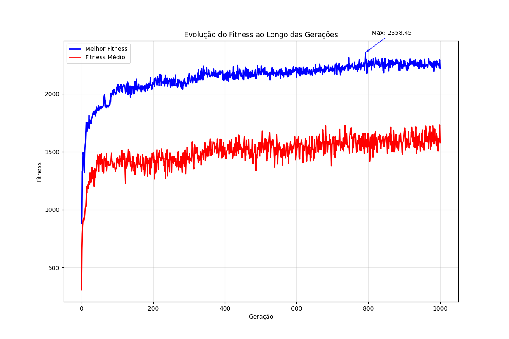
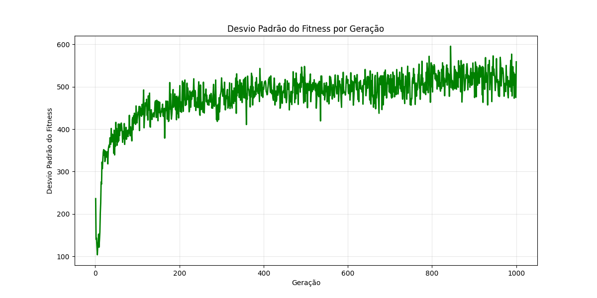
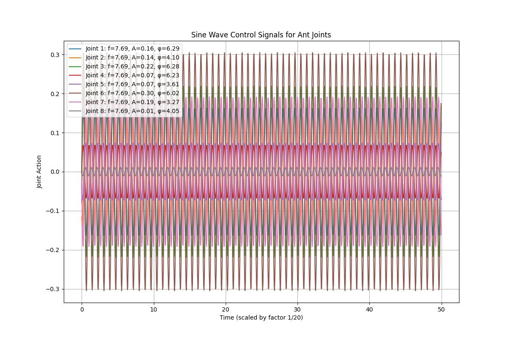
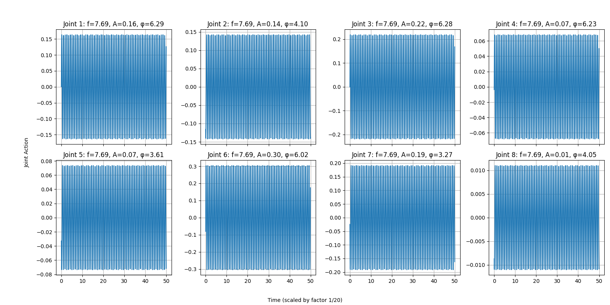

# Algoritmo Genético para Controle do Ant-v5 (MuJoCo)

## Descrição do Projeto

Este projeto implementa um Algoritmo Genético (AG) para otimizar o controle de um agente formiga (Ant-v5) no ambiente MuJoCo usando ondas senoidais. O objetivo é maximizar a distância percorrida pela formiga através da evolução de parâmetros que controlam a frequência, amplitude e fase das ondas senoidais aplicadas às 8 juntas do robô.

## Representação da Solução

Cada indivíduo é representado por **17 parâmetros**:
- **1 parâmetro**: Frequência compartilhada por todas as juntas (0 a 20 Hz)
- **8 parâmetros**: Amplitudes das ondas senoidais para cada junta (0.0 a 1.0)
- **8 parâmetros**: Fases das ondas senoidais para cada junta (0.0 a 2π)

A ação de cada junta no tempo `t` é calculada como:
```
action[i] = amplitude[i] * sin(frequency * t/20 + phase[i])
```

---

## Resultados Experimentais

### Melhor Solução Obtida

**Fitness Máximo Alcançado**: **2358.45**

#### Parâmetros da Melhor Solução

**Frequência Compartilhada**: 7.6907 Hz

**Parâmetros por Junta**:
| Junta | Amplitude | Fase (rad) |
|-------|-----------|------------|
| 1     | 0.1635    | 6.2854     |
| 2     | 0.1422    | 4.0960     |
| 3     | 0.2191    | 6.2805     |
| 4     | 0.0680    | 6.2298     |
| 5     | 0.0736    | 3.6050     |
| 6     | 0.3044    | 6.0163     |
| 7     | 0.1915    | 3.2718     |
| 8     | 0.0110    | 4.0498     |

---

## Tabela de Hiperparâmetros

| Parâmetro | Valor | Descrição |
|-----------|-------|-----------|
| **População** | 100 | Tamanho da população |
| **Gerações** | 1000 | Número máximo de gerações |
| **Elitismo** | 20 | Número de melhores indivíduos preservados |
| **Tamanho do Torneio** | 7 | Indivíduos por torneio na seleção |
| **Taxa de Crossover** | 0.9 | Probabilidade de crossover |
| **Taxa de Crossover Aritmético** | 0.5 | Probabilidade de usar crossover aritmético vs BLX-α |
| **Taxa de Mutação Inicial** | 0.05 | Taxa de mutação no início |
| **Taxa de Mutação Mínima** | 0.05 | Limite inferior da taxa de mutação adaptativa |
| **Taxa de Mutação Máxima** | 0.12 | Limite superior da taxa de mutação adaptativa |
| **Força de Mutação Inicial** | 0.25 | Desvio padrão inicial da mutação gaussiana |
| **Força de Mutação Final** | 0.05 | Desvio padrão final da mutação gaussiana |

### Operadores Genéticos

**Seleção**: Torneio (tamanho 7)

**Crossover**: 
- Crossover Aritmético Ponderado (50% de probabilidade)
- BLX-α (Blend Crossover) com α=0.5 (50% de probabilidade)

**Mutação**: Gaussiana adaptativa com força decrescente linear

### Critérios de Parada

1. **Número Máximo de Gerações**: 1000 gerações
2. **Convergência da População**: Ativado
   - Threshold: 0.01 (1% de diferença entre melhor e média)
   - Gerações consecutivas: 15

### Mecanismos Adaptativos

**Mutação Adaptativa (Taxa)**:
- Aumenta em 1.5x após 10 gerações de estagnação
- Decai em 0.95x quando há progresso
- Limitada entre 0.05 e 0.12

**Mutação Adaptativa (Força)**:
- Decaimento linear de 0.25 para 0.05 ao longo das gerações
- Permite exploração inicial ampla e refinamento final

---

## Apresentação Visual da Melhor Solução

### Vídeo da Simulação

**Localização**: `best_ant_solution.mp4`

A melhor solução foi testada no ambiente Ant-v5 e gravada em vídeo:


O vídeo demonstra o movimento do robô formiga utilizando os parâmetros otimizados pelo algoritmo genético.

---

## Gráficos de Evolução

### 1. Evolução do Fitness



**Descrição**: Este gráfico mostra a evolução do melhor fitness (linha azul) e do fitness médio (linha vermelha) ao longo das 1000 gerações. Observa-se uma rápida convergência inicial seguida de refinamento gradual, com o melhor fitness atingindo **2358.45**.

### 2. Desvio Padrão do Fitness por Geração



**Descrição**: O desvio padrão do fitness mostra a diversidade da população ao longo das gerações. A redução gradual indica convergência da população, enquanto picos ocasionais demonstram a atuação do mecanismo de mutação adaptativa para escapar de ótimos locais.

### 3. Ondas Senoidais da Melhor Solução



**Descrição**: Visualização das 8 ondas senoidais que controlam as juntas do robô formiga. Cada onda possui amplitude e fase únicas, mas compartilham a mesma frequência (7.69 Hz).



**Descrição**: Visualização detalhada de cada onda senoidal individualmente, mostrando os parâmetros específicos de cada junta.

## Como Executar

### Requisitos

```bash
pip install gymnasium numpy matplotlib pyyaml tqdm mujoco
```

### Configuração

Certifique-se de ter um arquivo `config.yaml` com os hiperparâmetros desejados.

### Execução

```bash
python genetic_algorithm_ant_atual.py
```

Os resultados serão salvos automaticamente em uma pasta numerada dentro de `graficos/`.
